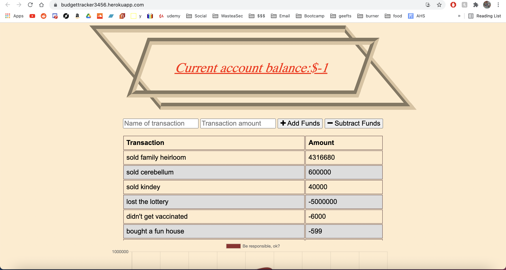
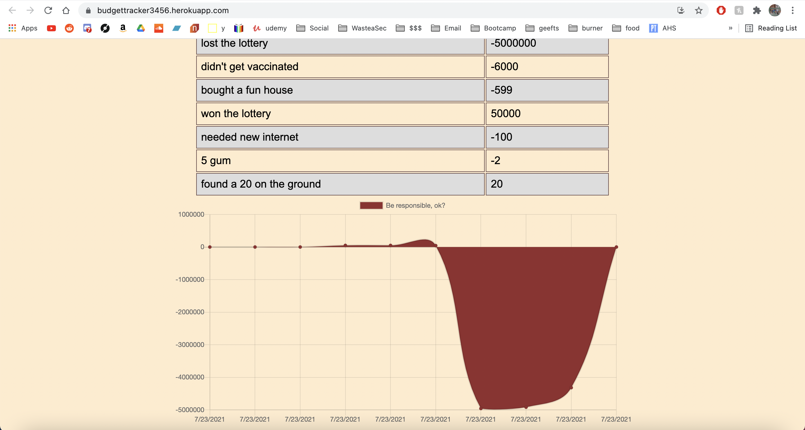

# Forest Wilson - Homework 19 - Offline budget tracker
MIT - (https://opensource.org/licenses/MIT) - For Good.

## Table of Contents:
- [Tech used](#tech-used)
- [Project description](#project-description)
- [Usage instructions](#usage-instructions)
- [Project installation](#project-installation)
- [Additional comments](#additional-comments)
- [Contribution information](#contribution-information)
- [Questions](#questions-or-concerns)
- [Extras](#extras)

### About This Project
* # Tech Used
  1. JavaScript
  2. Express.js
  3. MongoDB
  4. IndexedDB
  5. Service worker
  6. Heroku
  7. Mongo Atlas

* # Project description:
  It's time for you to start watching your spending habits, how else will you learn the value of a dollar? Use this PWA to log all of your money going in and out and see a graphical representation of your current balance. You may even keep track when you are in a different country and have no internet connection.

* # Usage instructions
  When you get money, give the transaction a name and click "add funds". When you lose money, click "subtract funds."

* # Project installation
  * from repo:
   - npm i
   - npm start
   - get logging.

  * from heroku:
   - open link
   - Enjoy.
  
 
* # Additional comments
  - This one was a true nightmare to complete, due to trying to find exactly where my errors were. I've had this working on my local host for weeks, but could not get my deployed version to match. In comes many days of debugging...

  - One of my errors was a typescript error with the transaction functions in index.js. This error was fixed by me setting up validation to make sure that when it fetched the api and set the transactions variable, that it always was creating an array, even if it was empty.

  - My most confusing error was coming from my service worker trying to fetch the api as well as an error with my "cacheAll." however, I think what eventually fixed this was my mongo uri config var in heroku was saved as a string, when in reality it probably makes it a string on build, so removing the double quotes from my var fixed it. I tried a million things though so this is only my best guess.

  - Pls dont mind the styling I used for this. I was fed up working on this code one night and just decided to get my mind off of it by making it ugly lol. Oh, also it seems like this is an activity that every bootcamp makes people do, so just a little something to differentiate myself.

#### Contribution information 
- If you would like to contribute to this project, please follow best practices and message me at one of the provided contacts bellow if you want to push!

###### Questions or concerns? 
* Please contact me at one of the following!
  Email - hexaforest@gmail.com
  gitHub - https://github.com/ForestW70/

# Extras
* Screenshots:
  
  

* Links:
  - [Repo page](https://github.com/ForestW70/Week-19-Offline-Budget-Tracker)
  - [Live site](https://budgettracker3456.herokuapp.com/)
